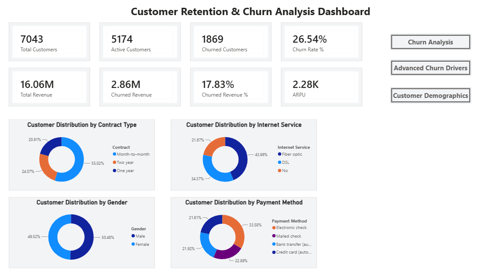
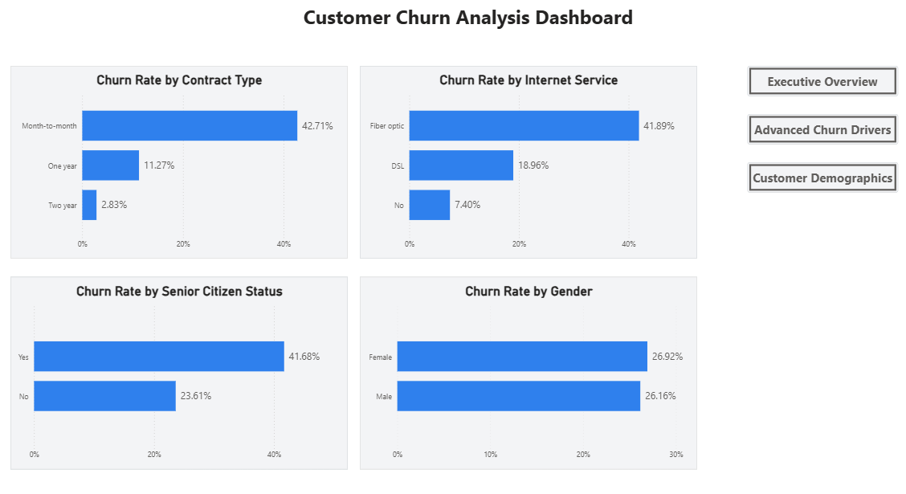
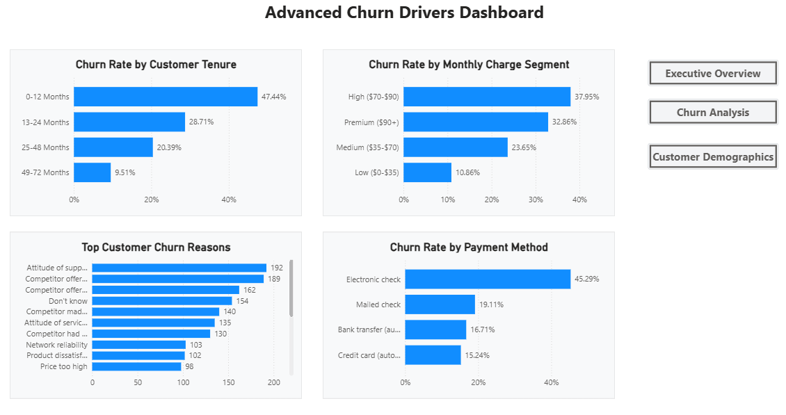
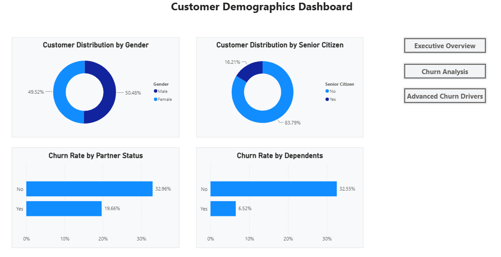
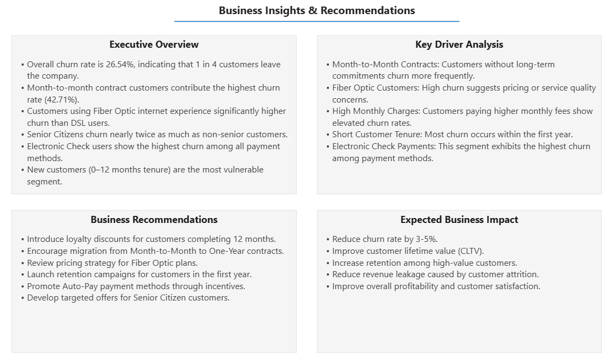

# Customer Retention & Churn Analysis

## Project Overview

This end-to-end Data Analytics project analyzes customer churn behavior and retention patterns using SQL, Python, and Power BI.

The objective is to identify churn drivers, understand customer behavior, and provide actionable business recommendations to improve customer retention, reduce revenue loss, and improve customer lifetime value.

---

## Business Problem

Customer churn directly impacts revenue and profitability for subscription-based businesses.

This project aims to:

- Identify factors contributing to customer churn
- Analyze customer demographics and behavior
- Discover high-risk customer segments
- Understand customer attrition patterns
- Recommend strategies to improve customer retention

---

## Tools Used

- SQL
- Python
- Power BI
- Power Query
- DAX

---

## Key KPIs

- Total Customers
- Active Customers
- Churned Customers
- Churn Rate %
- Retention Rate %
- Total Revenue
- Churned Revenue
- ARPU (Average Revenue Per User)
- Customer Lifetime Value (CLTV)

---

## Dashboard Pages

### Executive Overview

- KPI Summary
- Customer Distribution by Gender
- Customer Distribution by Senior Citizen Status
- Revenue Metrics
- Customer Retention Metrics

### Customer Churn Analysis

- Churn Rate by Contract Type
- Churn Rate by Internet Service
- Churn Rate by Senior Citizen Status
- Churn Rate by Gender

### Advanced Churn Drivers

- Churn Rate by Customer Tenure
- Churn Rate by Monthly Charge Segment
- Top Customer Churn Reasons
- Churn Rate by Payment Method

### Customer Demographics

- Customer Distribution by Gender
- Customer Distribution by Senior Citizen Status
- Churn Rate by Partner Status
- Churn Rate by Dependents

### Business Insights & Recommendations

- Executive Summary
- Key Driver Analysis
- Business Recommendations
- Expected Business Impact

---

## Dashboard Preview

### Executive Overview



### Customer Churn Analysis



### Advanced Churn Drivers



### Customer Demographics



### Business Insights & Recommendations



---

## Key Insights

### Customer Churn Overview

- Overall churn rate is **26.54%**.
- Active customers account for **73.46%** of the customer base.
- Churned customers contribute significantly to revenue loss.

### Contract Analysis

- Month-to-Month customers exhibit the highest churn rate.
- One-Year and Two-Year contract customers show significantly lower churn.

### Internet Service Analysis

- Fiber Optic customers churn considerably more than DSL users.
- Internet service type is a major churn driver.

### Tenure Analysis

- Customers within the first 12 months have the highest churn rate.
- Churn risk decreases as customer tenure increases.

### Payment Method Analysis

- Electronic Check users experience the highest churn rate.
- Automatic payment methods show better retention.

### Demographics Analysis

- Senior Citizens churn at a higher rate than non-senior customers.
- Customers without partners or dependents are more likely to churn.
- Gender has minimal impact on churn behavior.

---

## Business Recommendations

### Contract Strategy

- Encourage migration from Month-to-Month contracts to annual plans.
- Provide incentives for long-term subscriptions.

### Customer Retention Programs

- Launch targeted retention campaigns for customers within their first year.
- Identify and engage high-risk customers proactively.

### Pricing & Service Optimization

- Review Fiber Optic pricing and service quality.
- Improve customer value perception through bundled offerings.

### Payment Method Optimization

- Promote Auto-Pay and Credit Card payment methods through discounts and incentives.

### Customer Experience Enhancement

- Improve support quality and issue resolution times.
- Address service-related complaints contributing to churn.

### Senior Citizen Retention

- Design customized plans and support programs for senior customers.

---

## Expected Business Impact

Implementing the recommended retention strategies can:

- Reduce churn rate by 3–5%
- Improve customer retention
- Increase customer lifetime value (CLTV)
- Reduce revenue loss from churn
- Improve overall customer satisfaction

---

## Project Structure

```text
dataset/
database/
sql/
notebooks/
powerbi/
dashboard_screenshots/
reports/
README.md
```

---

## Repository Contents

### Dataset

- Telco Customer Churn Dataset

### SQL

- KPI Analysis
- Customer Segmentation Analysis
- Churn Analysis
- Window Functions
- Business Insights Queries

### Python

- Data Understanding
- Exploratory Data Analysis (EDA)
- Customer Retention Analysis
- Churn Analysis

### Power BI

- Interactive Multi-Page Dashboard
- DAX Measures
- Business Insights
- Executive Reporting

### Reports

- Business Problem
- Executive Summary
- Key Insights
- Recommendations

---

## Status

Completed ✅

---

## Author

Jashwanth Sai
